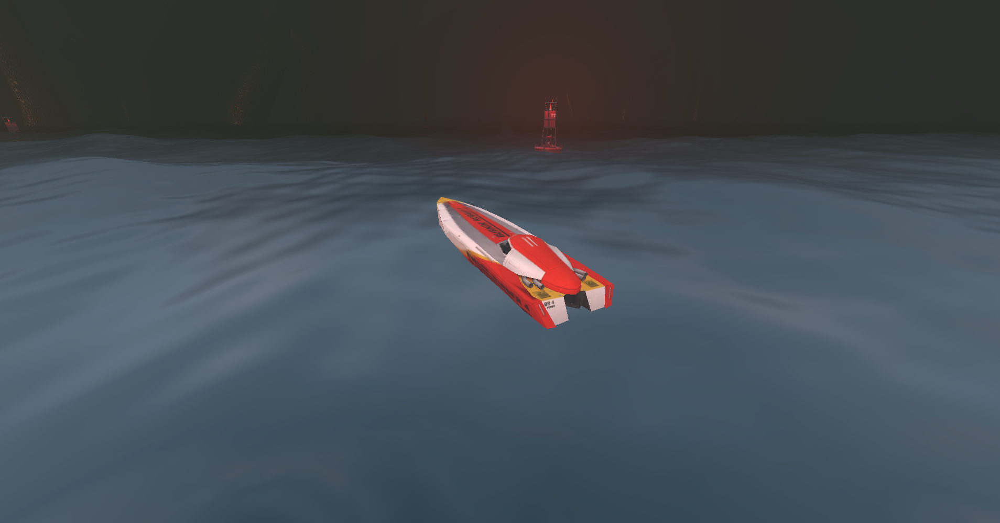
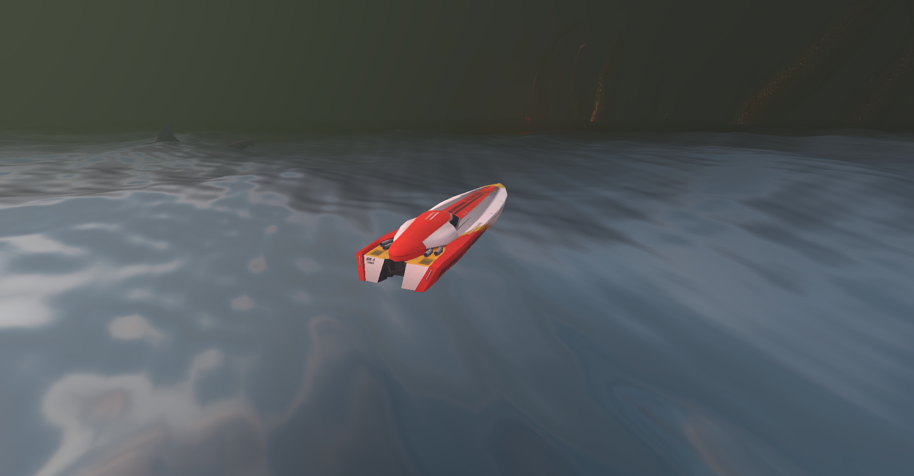

# Ocean Navigator

  
  

*Projet réalisé à trois : Antoine Dupuy, Leonardo Dib, Raphaël Ducournau* 

>**Note :** La version la plus à jour du projet se trouve sur la branche **`movementv1`**.

## Répartition de l'équipe
Pour ce projet, nous avons divisé les différentes parties :

* **Antoine Dupuy :** Développement de la physique avancée (flottabilité, traînée) et logique de navigation.
* **Raphaël Ducournau :** Création de l'aspect visuel de l'eau, des vagues et des shaders.
* **Leonardo Dib :** Level Design, gestion du brouillard et implémentation des ennemis (requins et krakens).

## Détails techniques Antoine Dupuy
J'ai implémenté :

* **Simulation de Flottabilité (`buoy.gd`) :** Système de points d'ancrage synchronisé avec les vagues.
* **Physique des Fluides (`boat_buoyancy.gd`) :** Modèle de traînée directionnelle (Drag) sur 3 axes.
* **Algèbre Vectorielle :** Stabilisation et calculs de couples pour le comportement du navire.

## Détails techniques Raphael Ducournau
J'ai implémenté une simulation visuelle de vagues sur un plan:

* **Fonction sinusoidale de vagues (gerstner): (``) :** .
* **Derivée de la fonction pour calculé les reflet sur l'eau (``) :** .
* **Approximation de la hauteur d'une vague en un point (qui a été déplacer (``) :** .
